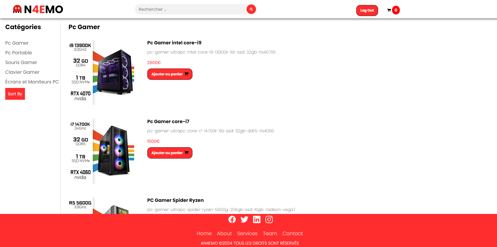

# AN4EMO

AN4EMO , un projet de site e-commerce dédié à la vente de composants et accessoires pour PC gamer et portables. Ce site est conçu pour offrir une expérience d'achat fluide et intuitive, permettant aux passionnés de jeux vidéo et aux utilisateurs d'ordinateurs portables de trouver facilement les produits qu'ils recherchent.

## Technologies utilisées

- **Front-end** :
  - HTML 
  - CSS 
  - JavaScript 
  - Frameworks : 
    - Bootstrap 

- **Back-end** :
  - PHP 

## Prérequis
Pour utiliser ce projet, vous aurez besoin de :

- Un serveur locale XAMPP (ou vien WAMP)
- Une base de données MySQL

## Installation
1. Téléchargez ou clonez le répertoire de ce projet sur votre ordinateur.
2. Placez le répertoire du projet dans le répertoire `htdocs` de votre environnement d'exécution PHP (XAMPP).
3. Importez le fichier cd `provisionrapide.sql` dans votre base de données MySQL.
4. Ouvrez votre navigateur web et accédez à l'application en saisissant l'URL `http://localhost/nom_du_répertoire_du_projet`.

## login
- **Adminisrateur** : 
    login: `admin@gmail.com` 
    password: `admin`
- **Utilisateur** : 
    login: `user@gmail.com` 
    password: `user`   

## License
This project is licensed under the MIT License. See the `LICENSE` file for more details.

## Contact
If you have any questions or feedback, feel free to reach out to me:
- **Anass Chammami** :
  - 
  - 
  - 
   
- **Anas Errabouli** :
  - 
  - 
  -    

